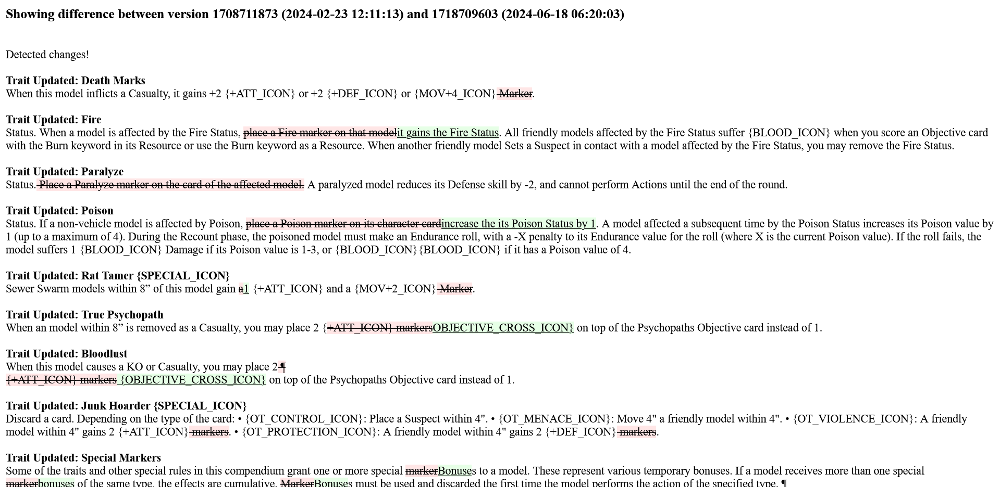

# Bat Stats API

API companion to support backend functionalities of [bat_stats_ui](https://github.com/jghibiki/bat-stats-ui)


*Start up DB, and web app:*
```shell
docker-compose up -d
```

*Start DB locally, but not web app:*
```shell
docker-compose up -d db
```

Starting the app locally:
```shell
python -m bat_stats_api
```

Once started wait a few seconds and the app will reach out to the BMG api to check the latest app data version, and then
if there are updates it will download them and store them in the postgres db.

The app will periodically poll for the latest api version and will pull any updates it sees.

Previous versions are retained in the database indefinitely in the current implementation. Future updates will add a 
process to partially prune old versions (i.e. retain some metadata but drop specifics about the version).

History retention of versions is useful for a few things:

*Creating a diff tool.*

e.g. http://localhost:8080/diff?base=1708711873&alt=1718709603
To test locally you'll need to run the app for a while until there is an app data update, and then replace the version
numbers with the old (base) and new (alt) versions of the api data.



*Once a list editor has been implemented, lists can be flagged as "needs review"*

This way, users can see that maybe some tweaks will be required, potentially because points values, or traits have 
changed, and the list may no longer be valid or work the way it was originally intended to.